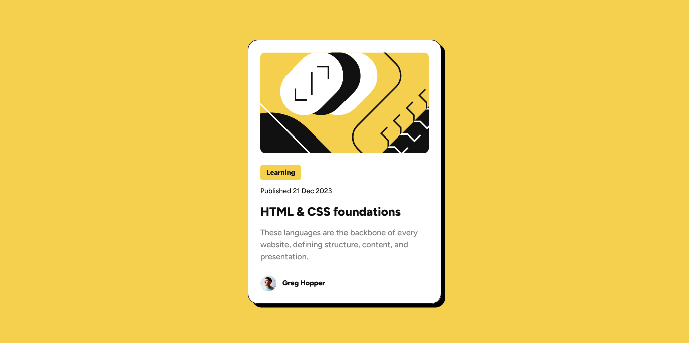

# Frontend Mentor - Blog preview card solution

This is a solution to the [Blog preview card challenge on Frontend Mentor](https://www.frontendmentor.io/challenges/blog-preview-card-ckPaj01IcS). Frontend Mentor challenges help you improve your coding skills by building realistic projects.

## Table of contents

- [Overview](#overview)
  - [The challenge](#the-challenge)
  - [Screenshot](#screenshot)
  - [Links](#links)
- [My process](#my-process)
  - [Built with](#built-with)
  - [What I learned](#what-i-learned)
- [Author](#author)

## Overview

### The challenge

Users should be able to:

- See hover and focus states for all interactive elements on the page

### Screenshot

### Links

- Solution URL: [Solution URL](https://github.com/princeeze/blog-preview-card-main)
- Live Site URL: [Live Site](https://main--princetestblog.netlify.app/)

## My process

### Built with

- Semantic HTML5 markup
- CSS custom properties
- Flexbox
- Mobile-first workflow
- [BEM](https://getbem.com)

### What I learned

I was able to implement css pseudo-classes and use other conventions.

## Author

- Website - [Prince Eze](princeeze.webflow.io)
- Frontend Mentor - [@princeeze](https://www.frontendmentor.io/profile/princeeze)
- Twitter - [@princeeze](https://www.twitter.com/princeeze)
